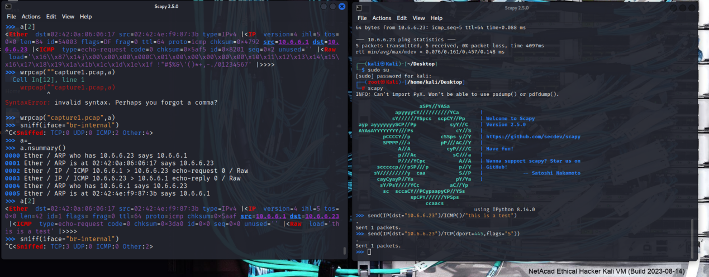

# 03 · Information Gathering and Vulnerability Scanning

> Module 3 of my Ethical Hacking / Penetration Testing course notes.
> Covers reconnaissance (passive and active), enumeration techniques, and
> vulnerability scanning fundamentals.

## Table of Contents

- [Reconnaissance Overview](#reconnaissance-overview)
- [Passive Reconnaissance](#passive-reconnaissance)
- [Active Reconnaissance (Enumeration)](#active-reconnaissance-enumeration)
- [Nmap Scanning](#nmap-scanning)
- [Types of Enumeration](#types-of-enumeration)
- [Packet Crafting with Scapy](#packet-crafting-with-scapy)
- [Tcpdump & Wireshark](#tcpdump--wireshark)
- [Vulnerability Scanning](#vulnerability-scanning)

## Reconnaissance Overview

Reconnaissance is the initial step of a cyberattack (or an authorized
penetration test): gathering information about a target before touching
it directly.

| Type | Description | Risk |
|---|---|---|
| **Active Reconnaissance** | Directly engages with the target. | Higher — risk of crashing or alerting the target system. |
| **Passive Reconnaissance** | Does not directly engage with the target. | Lower — highly unlikely to disrupt the target. |

**Common active techniques:** host enumeration, network enumeration, user
enumeration, group enumeration, network share enumeration, web page
enumeration, application enumeration, service enumeration, packet
crafting.

**Common passive techniques:** domain enumeration, packet inspection,
OSINT (Open-Source Intelligence), Recon-ng, eavesdropping.

## Passive Reconnaissance

### 1. OSINT Framework

[osintframework.com](https://osintframework.com/) — a curated collection
of OSINT resources and tools.

### 2. SpiderFoot

An automated OSINT scanner.

```bash
┌──(kali㉿kali)-[~]
└─$ spiderfoot -l 127.0.0.1:5001
# Enter a target in the web UI, click Scan, then review the results
```

### 3. Recon-ng

A modular reconnaissance framework, started with `recon-ng` in the
terminal. It uses **workspaces** to isolate investigations from one
another.

```bash
# Manage workspaces
workspaces <remove | create | list | load> <workspace_name>

# List installed modules
modules search

# List available commands
help

# List modules available to install
marketplace search

# Learn more about a module
marketplace info "<module_name>"

# Install a module
marketplace install <module_name>

# Load a module
modules load <module_name>

# Configure and run
options set source <source_name>
run
```

### 4. DNS Lookup

Querying DNS servers to gather information about a target's
infrastructure (IP addresses, subdomains, mail servers).

**Tools:** `dnsrecon`, `dig`, `nslookup`, `whois`

```bash
dnsrecon -d h4cker.org
dig h4cker.org
dig h4cker.org mx
nslookup h4cker.org
```

`nslookup` interactive mode:

```bash
> set type=mx
> set type=ns
> set type=txt
```

`whois` returns domain registrar details.

### 5. Application Hosting and Subdomains

Identify where an application is hosted (self-hosted vs. cloud) and who
owns the associated IP addresses.

```bash
$ host netflix.com
netflix.com has address 3.230.129.93
netflix.com has address 52.3.144.142
netflix.com has address 54.237.226.164

$ whois 3.230.129.93 | grep OrgName
OrgName:        Amazon Technologies Inc.
OrgName:        Amazon Data Services NoVa
```

### 6. Cryptographic Flaws (SSL/TLS Recon)

Attackers inspect SSL/TLS certificates during reconnaissance to uncover
sensitive organizational data, cryptographic weaknesses, and
infrastructure URIs. Compromised certificates must be invalidated via
CRLs or OCSP so they are no longer trusted.

**Tool:** [crt.sh](https://crt.sh) — certificate transparency search.
More info: [certificate.transparency.dev](https://certificate.transparency.dev).

**Methods for viewing certificates:**

- **Web browser** — click the padlock icon next to a URL for issuing organization, expiration date, and encryption algorithm (e.g., SHA-256 with RSA).
- **Windows** — run `certmgr.msc` to open the certificate manager.
- **Kali Linux** — trusted certificates are stored in `/usr/share/ca-certificates/mozilla`. Use `ls -l | grep root` to list trusted root certificate files.

**Kali SSL Tools:**

| Tool | Description | Category |
|---|---|---|
| `sslscan` | Queries SSL services to determine which ciphers are supported. | Reconnaissance |
| `ssldump` | Analyzes and decodes SSL traffic. | Exploitation |
| `sslh` | Runs multiple services on port 443. | Utility |
| `sslsplit` | Enables on-path (MitM) attacks on SSL-encrypted connections. | Exploitation |
| `sslyze` | Analyzes the SSL configuration of a server by connecting to it. | Reconnaissance |

`aha` can be used to convert terminal SSL scan output into an HTML page.

### 7. Company Reputation and Security Posture

Security breaches damage reputation and give attackers leverage for
future attacks. Key data sources attackers use:

**i. Password Dumps** (data from prior breaches)

- **Sources:** previous breaches, Pastebin, the dark web, GitHub.
- **Key tool:** `h8mail` (`pip3 install h8mail`) — searches for exposed emails and passwords across multiple breach repositories.
- **Other tools:** WhatBreach, LeakLooker, Buster, Scavenger, PwnDB.

**ii. File Metadata**

Hidden details embedded in files (images, Word, Excel).

- **EXIF** (Exchangeable Image File Format) — metadata in digital photos that can reveal GPS coordinates, device models, and timestamps.

**iii. Strategic Search Engine Analysis (Google Dorking)**

Using advanced search operators to find sensitive information not
intended for public view.

| Operator | Description |
|---|---|
| `filetype:` | Limits results to a specific file format (e.g., `filetype:pdf`). |
| `inurl:` | Searches for text within the URL. |
| `intitle:` | Searches for text within the page title. |
| `site:` | Restricts results to a specific site. |
| `allintext:` | Returns results containing the query word in the page text. |

**Examples:**

```text
ethical hacker site:pearson.com filetype:pdf
ethical hacker intitle:certification
```

Google's own [Advanced Search](https://www.google.com/advanced_search)
can also be used for the same purpose.

**iv. Website Archiving & Caching**

Lets attackers view old versions of a website to find removed sensitive
data.

- **Tool:** [Wayback Machine](https://archive.org) (archive.org)

**v. Public Source Code Repositories**

- **Platforms:** GitHub, GitLab
- **GHDB** (Google Hacking Database) — an index of user-created dorks designed to uncover interesting, potentially sensitive information unintentionally exposed on the internet. See [exploit-db.com](https://www.exploit-db.com/).

## Active Reconnaissance (Enumeration)

### Nmap

Nmap (Network Mapper) is an open-source tool used to discover hosts and
services on a network by sending packets and analyzing the responses.

#### TCP Scans

**TCP Connect Scan (`-sT`)** — completes the full TCP three-way handshake (SYN, SYN-ACK, ACK).

```bash
nmap -sT [IP]
```

- **Open:** target sends SYN/ACK; Nmap sends ACK (connection established).
- **Closed:** target sends RST (reset).

**TCP SYN Scan (`-sS`)** — a "half-open" scan; a full connection is never established.

```bash
nmap -sS [IP]
```

```text
Nmap (Scanner)                          Target Host
     |------------- 1. SYN Packet ------------->|
     |<----------- 2. SYN/ACK (Open) -----------|
     |------------- 3. RST Packet -------------->|
```

**TCP FIN Scan (`-sF`)** — sends a FIN packet (normally used to close a connection) to a port with no prior contact.

```bash
nmap -sF [IP]
```

- **Open:** target ignores the packet (no response).
- **Closed:** target sends back an RST packet.

#### UDP Scan (`-sU`)

Sends a UDP packet to the target port; since UDP is connectionless, Nmap
waits to see if anything comes back.

```bash
nmap -sU [IP]
```

- **Open:** target sends a UDP response (rare) or no response (marked `open|filtered`).
- **Closed:** target sends an ICMP Port Unreachable message.
- **Best for:** finding DNS (53), SNMP (161), or DHCP services; bypassing simple firewalls. Does not work reliably against Windows targets.

#### Host Discovery Scan (`-sn`)

Also called a **ping sweep**. Doesn't scan ports — only checks whether a
device is alive, by sending an ICMP Echo Request, a TCP SYN to port 443,
and a TCP ACK to port 80.

```bash
nmap -sn [network/prefix]
```

Best for quickly finding all active devices on a large subnet (e.g.,
`192.168.1.0/24`).

#### Timing Options (`-T0` to `-T5`)

Control the speed and "stealth" of a scan.

| Option | Name | Usage Scenario |
|---|---|---|
| `-T0` / `-T1` | Paranoid / Sneaky | Avoiding detection by an IDS. |
| `-T2` | Polite | Reduces bandwidth usage. |
| `-T3` | Normal | Default timing. |
| `-T4` | Aggressive | Fast scans for reliable, modern networks. |
| `-T5` | Insane | Extremely fast; may crash targets or miss ports. |

```bash
nmap -T4 [IP]   # Aggressive scan
```

## Types of Enumeration

### Host Enumeration

Scans subnets internally, or targets scoped IPs externally, to map active
hosts. Tools: Nmap, Masscan.

```bash
nmap -sn <ip_subnet>
```

### User Enumeration

Identifying valid usernames on a target system — typically performed
after gaining internal network access, though external web vectors also
exist.

**Windows & Samba SMB Enumeration (Port 445)**

In local networks, user enumeration heavily relies on exploiting
misconfigurations in the Server Message Block (SMB) protocol or MSRPC
(Microsoft Remote Procedure Call).

SMB authentication messages that can leak data if misconfigured:

- **`SMB_COM_NEGOTIATE`** — client and server negotiate dialects, flags, and security options.
- **`SMB_COM_SESSION_SETUP_ANDX`** — transmits authentication data (username, password, domain).

**A. Nmap NSE Scripts** — automate user harvesting via scripts targeting port 445:

```bash
nmap --script smb-enum-users.nse -p 445 <target-ip>
```

**B. RID Cycling** (`enum4linux` / `enum4linux-ng`)

SIDs (Security Identifiers) wrap a variable-length **Relative Identifier
(RID)** at the end. Standard users typically start at RID `1000`, while
built-in administrators use `500`. These tools cycle through RID ranges
(e.g., `500–550`, `1000–1050`), requesting information for each RID
directly from the SAM database.

```bash
enum4linux-ng.py -As <target-ip>
```

### Group Enumeration

Helps determine the authorization roles used in the target environment.

```bash
nmap --script smb-enum-groups.nse -p445 <host>
```

### Network Share Enumeration

Identifies systems on a network sharing files, folders, and printers —
useful for mapping the attack surface of an internal network.

```bash
nmap --script smb-enum-shares.nse -p 445 <host>
```

**Additional SMB enumeration/fingerprinting:**

```bash
nmap -sC 192.168.88.251
```

`enum4linux` can also be used for the same purpose.

### Web Page / Web Application Enumeration

Maps out the attack surface of a web application.

```bash
nmap -sV --script=http-enum <target>
```

**Tool:** `nikto` — a vulnerability scanner that can also be used here.

### Service Enumeration

Identifies the services running on a remote system — a primary function
of Nmap as a port scanner.

```bash
nmap --script smb-enum-processes.nse \
     --script-args smbusername=<username>,smbpass=<password> \
     -p445 <host>
```

### Enumeration via Packet Crafting

Scapy is used for custom packet crafting.

```python
# 1. Send custom text inside an ICMP Echo Request
send(IP(dst="<target>")/ICMP()/"malicious_payload")

# 2. Perform a custom TCP SYN scan on port 445
ans, unans = sr(IP(dst="<target>")/TCP(dport=445, flags="S"))
```

## Packet Crafting with Scapy

Scapy can be used for both packet crafting and packet sniffing.



**Common commands:**

```python
ls()                     # list available protocols and formats
ls(IP)                   # list the available fields in an IP packet header
sniff()                  # sniff all traffic
sniff(iface="br-internal")                          # sniff a specific interface
sniff(iface="br-internal", filter="icmp", count=10)  # filter + count
wrpcap("capture1.pcap", a)                           # write captured data to a pcap file
send(IP(dst="10.6.6.23")/ICMP()/"This is a test")    # send a crafted packet
```

## Tcpdump & Wireshark

Used to capture traffic on the network.

```bash
┌──(kali㉿kali)-[~]
└─$ sudo tcpdump -i eth0 -s 0 -w packetdump.pcap
```

- `-i` — interface
- `-s` — snapshot length of each packet (`0` = default size, 262144 bytes)
- `-w` — write output to a pcap file

## Vulnerability Scanning

Scanners like Nmap perform host and port enumeration; once a scanner
knows what software/service is running on each open port, that data is
stored and checked against a vulnerability database. This module focuses
on **host-based vulnerabilities** related to the operating systems and
services running on target devices.

### Types of Vulnerability Scans

| Scan Type | Description |
|---|---|
| **Unauthenticated scan** | Shows only network services exposed to the network; enumerates open ports on the target host. |
| **Authenticated scan** | Requires credentials with root-level access to the system be provided to the scanner. |
| **Discovery scan** | Identifies the attack surface of a target; a port scan is a major part of this scan type. |
| **Full scan** | Enables every scanning option in the policy. |
| **Stealth scan** | Runs scanning processes without alerting the environment's defenses. |
| **Compliance scan** | Tests networks and applications against market, governance, or regulatory requirements. |

### Vulnerability Scanning with Kali Tools

**Nmap**

```bash
# Step 1: confirm host is reachable
ping 10.6.6.23

# Step 2: check open ports and running services
nmap -sV 10.6.6.23

# Step 3: check the host's operating system
nmap -O 10.6.6.23

# Step 4: run a vulnerability-detection NSE script
nmap -sV --script vulners --script-args mincvss=4 10.6.6.23
```

**GVM (Greenbone Vulnerability Management)**

An open-source vulnerability management tool.

```bash
sudo gvm-start   # start
sudo gvm-stop    # terminate
```

---

**Previous:** [02 · Intro to Ethical Hacking](02-intro-to-ethical-hacking.md) · **Next:** [04 · Social Engineering Attacks](04-social-engineering-attacks.md)
